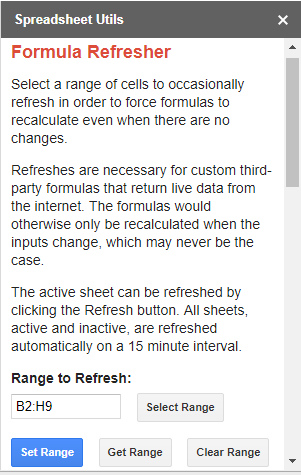
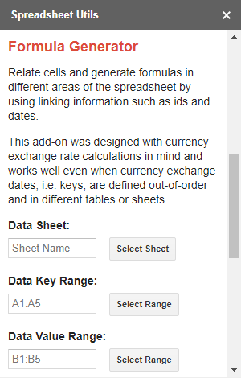
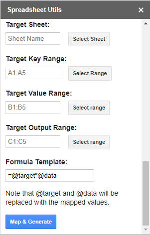

# Spreadsheet Utils
Custom Google Sheets add-on for timed formula refreshes and cell mapping.

## Formula Refresher
Select a range of cells to occasionally refresh in order to force formulas to recalculate even when there are no changes.

Refreshes are necessary for custom third-party formulas that return live data from the internet. The formulas would otherwise only be recalculated when the inputs change, which may never be the case.

The active sheet can be refreshed by clicking the Set Range button. The add-on will refresh all sheets with ranges set automatically every 15 minutes.

I created Formula Refresher to make it easier to get up-to-date Bitcoin prices in my spreadsheet in combination with a third-party CRYPTOFINANCE formula that someone else created. Here's the info for the CRYPTOFINANCE formula:

=CRYPTOFINANCE("BTC/EUR", "change", "24h")

[CRYPTOFINANCE Add-on Store](https://chrome.google.com/webstore/detail/cryptofinance/bhjnahcnhemcnnenhgbmmdapapblnlcn?hl=en)

[CRYPTOFINANCE Blog Post](https://jbuty.com/how-to-get-crypto-currencies-rates-and-more-in-google-sheet-1a57e571bc14)

You can change the refresh interval in the script editor. Just be aware that the Sheets API limits you to 20,000 HTTP requests per day. If you refresh hundreds of formulas that make HTTP requests on a 1 minute interval, then it won't take long before the formulas start returning errors telling you to wait for 24 hours. 

[Limits Document](https://developers.google.com/apps-script/guides/services/quotas)

Note that an automated refresh may interrupt/cancel a manual formula entry taking place at the same time. 

## Formula Generator
Relate cells and generate formulas in different areas of the spreadsheet by using linking information such as ids and dates.

This add-on was designed with currency exchange rate calculations in mind and works well even when currency exchange dates, i.e. keys, are defined out-of-order and in different tables or sheets.

The formula field allows the user to generate formulas and reference the mapped values with special @target and @data keywords.

Note that Google Sheets ships with a built in function called DGET that allows you to define a "database" range of cells, for example a table of currency exchange rates, and then "query" it with SQL like queries. I stopped using the Formula Generator part of my add-on once I discovered the wonders of the DGET function. 

[DGET Formula Google Docs](https://support.google.com/docs/answer/3094148?hl=en)

## Installation Instructions
I never published the add-on on the add-on store, so you will have to get it up and running locally to try it.

To install this add-on:
1. Open a Google Spreadsheet
2. Navigate to Tools -> Script Editor
3. Create a new project and copy the Code.gs and Page.html files
4. Navigate to Run -> Test as add-on...
5. Select a spreadsheet to deploy against
6. In the spreadsheet, navigate to Add-ons -> Spreadsheet Utils -> Show

## Screenshots

